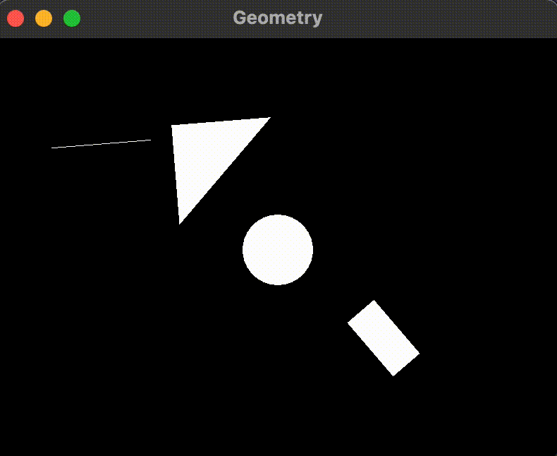

# Geometry

This program allows you to draw geometric primitives using SFML.



## Installation

To build and install the project, follow these steps:

1. Clone the repository:

   ```
   git clone https://github.com/your/repository.git
   ```

2. Change to the project directory:

   ```
   cd Geometry
   ```

3. Build the project using CMake:

   ```
   cmake -S . -B ./build
   cmake --build ./build
   ```

4. Run the executable:

   ```
   ./build/Geometry
   ```

## Dependencies

The project uses the SFML library (version 2.5.1) for graphics, window management, and system functionality. The library source code will be downloaded automatically during the build process.

## Usage

The program allows you to draw different types of primitives, such as lines, circles, triangles, rectangles, and squares. The following code snippet demonstrates how to use the program:

```cpp
#include <SFML/Graphics.hpp>
#include <memory>

#include "line.h"
#include "circle.h"
#include "triangle.h"
#include "rectangle.h"
#include "square.h"

int main() {
  sf::RenderWindow window(sf::VideoMode(800, 600), "Geometry");
  std::vector<std::unique_ptr<Primitive>> primitives;
  primitives.emplace_back(std::make_unique<Line>(100, 100, 200, 200));
  primitives.emplace_back(std::make_unique<Circle>(400, 300, 50));
  primitives.emplace_back(std::make_unique<Triangle>(300, 100, 400, 200, 200, 200));
  primitives.emplace_back(std::make_unique<Rectangle>(500, 400, 100, 50));
  while (window.isOpen()) {
    sf::Event event;
    while (window.pollEvent(event)) {
      if (event.type == sf::Event::Closed) window.close();
    }
    window.clear();
    for (auto& primitive : primitives) {
      primitive->draw(window);
      primitive->rotate(0.2f);
    }
    window.display();
    sf::sleep(sf::milliseconds(50));
  }
  return 0;
}
```

## License

This project is licensed under the [MIT License](LICENSE).